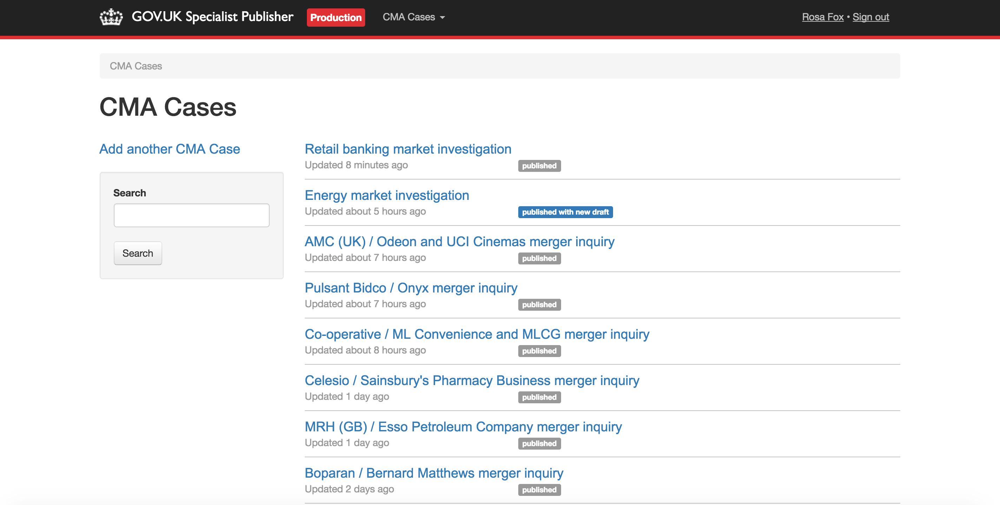

# Specialist Publisher

Publishing App for Specialist Documents.

## Screenshots


*Specialist Documents - CMA Case Format*


*A Specialist Document on gov.uk*

## Live examples

- [AAIB Reports](https://www.gov.uk/aaib-reports)
- [Business Finance Support Schemes](https://www.gov.uk/business-finance-support)
- [CMA Cases](https://www.gov.uk/cma-cases)
- [Countryside Stewardship Grants](https://www.gov.uk/countryside-stewardship-grants)
- [DFID Research Outputs](https://www.gov.uk/dfid-research-outputs)
- [Drug Safety Update](https://www.gov.uk/drug-safety-update)
- [ESI Funds](https://www.gov.uk/european-structural-investment-funds)
- [International Development Funds](https://www.gov.uk/international-development-funding)
- [Medical Safety Alerts](https://www.gov.uk/drug-device-alerts)
- [MAIB Reports](https://www.gov.uk/maib-reports)
- [RAIB Reports](https://www.gov.uk/raib-reports)
- [Vehicle Recalls and Faults Alerts](https://www.gov.uk/vehicle-recalls-faults) (not live)

## Nomenclature

- **Format**: Category of a Document. Format names are listed in the `Live Examples` section above and include `MAIB Reports` and `CMA Cases`.
- **Finder**:  Sometimes Formats are referred to as Finders. They are called 'Finders' because each one of them creates a finder on GOV.UK, e.g. https://www.gov.uk/raib-reports. The formats are served by [Finder Frontend](https://github.com/alphagov/finder-frontend).
- **Document**: Specialist Documents are created by Government editors and can be published to gov.uk. Documents differ from each other depending on their format. These differences are largely determined by what is contained in the [schema](https://github.com/alphagov/specialist-publisher-rebuild/blob/add-dfid-review-status/lib/documents/schemas/aaib_reports.json) of a format.
- **Schema**: JSON files defining attributes for each format, including `base_path`, `document_noun` and `document_type`. It also contains the facets and their possible values for each `document_type` which are displayed by `_form.html.erb`.

## Technical documentation

Specialist Publisher is a Ruby on Rails application used to create and manage documents. This application does not store documents in a database of its own. Instead it sends JSON data to the publishing-api where it is persisted in a Postgres datastore. This data is then requested from the publishing-api and displayed to the user.

Another result of publishing a document is that a call is made to the Email Alert Api which will notify Gov Delivery to send an email to subscribers. These emails are sent when a document is first published and also when an editor makes a major update. This is true for all formats other than Drug Safety Updates which are instead sent via a monthly email newsletter.

Attachments are sent to and then handled by Asset Manager. When an attachment is uploaded, Asset Manager will scan the attachment for viruses and then return a URL from which the attachment can be viewed. When an attachment is deleted it will be 'soft' deleted from Asset Manager so as to be no longer viewable by a user.

The original Specialist-Publisher codebase contained Manuals and Finders in the same application. Manuals are now being managed by [Manuals Publisher](https://github.com/alphagov/manuals-publisher).

## Pre-production

A number of formats are [flagged](https://github.com/alphagov/specialist-publisher/blob/f8e93142dfad6f3971a73c923b01f2e7352bdb54/lib/documents/schemas/tax_tribunal_decisions.json#L64) as `pre-production`. `pre-production` documents are only publishable on development and integration.

## Dependencies

- [alphagov/asset-manager](http://github.com/alphagov/asset-manager): provides uploading for static files
- [alphagov/publishing-api](http://github.com/alphagov/publishing-api): documents are sent here, persisted and then requested.
- [alphagov/email-alert-api](http://github.com/alphagov/email-alert-api): sends emails to subscribed users when documents are published
- Mongo: mongodb used for storing local users
- [These Gems](https://github.com/alphagov/specialist-publisher-rebuild/blob/master/Gemfile)

### Running the application

```
$ ./startup.sh
```
If you are using the GDS development virtual machine then the application will be available on the host at http://specialist-publisher.dev.gov.uk/

### Granting permissions

You may find that you can't see any documents after replicating data. To fix
this, you need to grant user permissions in this application:

```bash
bundle exec rake permissions:grant['Chris Patuzzo'] # Or whichever user you're logged in as.
```

You also need to set the `app_name` for the Dummy API User in Publishing API:

```ruby
User.find_by(email: "dummyapiuser@domain.com").update!(app_name: "specialist-publisher")
```

### Populate development database

If you're starting from a blank database, you can quickly get your local database into working order with:

```
$ bundle exec rake db:seed
```

Currently this:
* creates a default user record with basic permissions that allows you to log in and create a new document


### Running the test suite

```
$ bundle exec rake
```

## Adding a new Specialist Document format

👉 [Creating a new specialist document type](/docs/creating-a-new-specialist-document-type.md)

## Running tasks

You can use the Jenkins rake task runner to run these tasks.

### Discarding a draft document

If a document has been created in draft, it can be discarded with this task:
`ops:discard['some-content-id']`

Drafts can also be discarded by running a similar task from the Publishing API:

`discard_draft['some-content-id']`

See [Admin Tasks](https://github.com/alphagov/publishing-api/blob/master/doc/admin-tasks.md)

### Triggering an email notification

If an email has not been sent for a document, it can be re-triggered with this task:
`ops:email['some-content-id']`

### Setting the public_updated_at

If a document has an incorrect public_updated_at, it can be set with this task:
`ops:set_public_updated_at['some-content-id','2016-01-01']`

This is useful if a published document is appearing with an incorrect published time on GOV.UK. This is not something users of the publishing app can set manually and so occasionally we get support requests to change this.

Rails will call `DateTime.parse` on the string provided, so most formats should work. You can also pass ‘now’ to use the current time.

You can’t currently set the `public_updated_at` field if a publisher has created a new draft for the document. You’ll either need to discard it or publish it first for this task to succeed.

### Republishing

Republishing is useful if content failed to make its way through the system. This might be the case if an error was thrown somewhere along the way. Republishing a document will notify Publishing API of the change (which will in turn notify RUMMAGER via a notifaction queue). It will not send email notifications.

You can republish a single document with this task:
`republish:one['some-content-id']`

You can republish all documents for a document_type with this task:
`republish:document_type['some_document_type']`

You can republish all specialist documents with this task:
`republish:all`

These last two tasks place a large number of items on Specialist Publisher’s sidekiq queue. These tasks could take a very long time to complete. You can’t currently republish published documents if a publisher has created a new draft for the document.

## Phase 2 migration

There is tonnes of information on our learnings from migrating this app to
"phase 2" [here](./docs/phase-2-migration/README.md).
